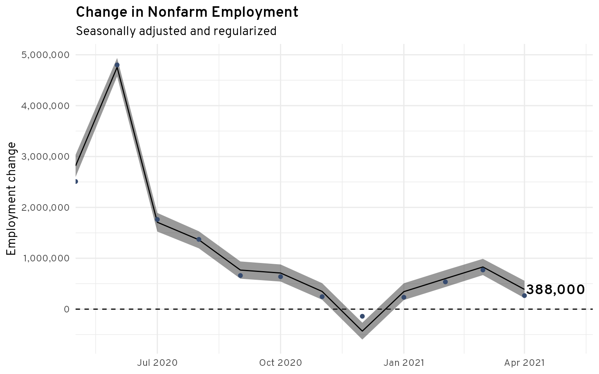

# Better Jobs Numbers

Code to auto-generate a report which calculates improved BLS Current Employment 
Statistics (CES) estimates of the change in nonfarm payroll, by predicting
the final revised numbers from the initial numbers, ADP payroll data,
and total monthly initial new unemployment claims.

## Generating the report
First run `Rscript run.R install` at the command line to install the required
packages. Then run `Rscript run.R make` to make the report.

## Data
The merged dataset can be found at `data/jobs.csv`.
